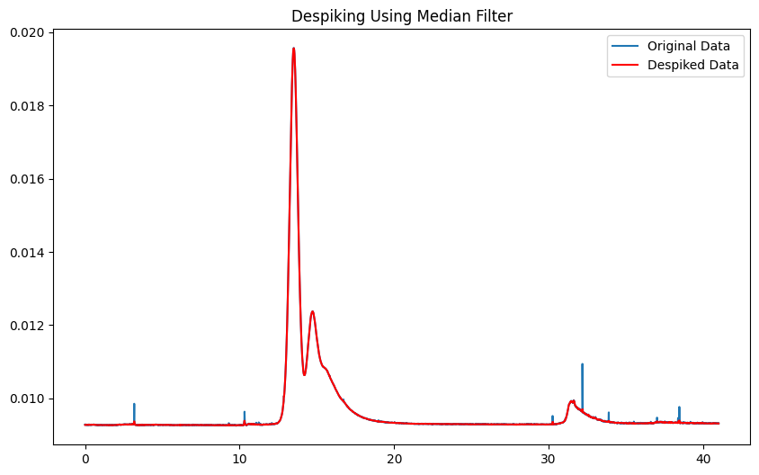

# Project Description

The team at NMI currently use Astra8 Software to do data analysis using their AF4 machine. This software acts as a kind of 'black box', in that obtaining fundamental proof of the algorithms / code used to do data treatment is either extremely difficult to obtain, or not possible (realistically). Additionally, the reports generated by Astra often contain too much non-useful information.

Traceability is a foundational cornerstone of nanometrology (and metrology in general), and so, I've been tasked with creating an open source template that will do the required data treatment, while also giving greater flexibility to displaying only the data that is required for a specific kind of experiment or sequence.

The order of treatments done by the team currently using Astra is:
1. Despiking
2. Baseline Selection
3. Peak Definitions
4. Molar Mass & Radius from Light Scattering (LS)
5. Hydrodynamic Radius $R_h$ from LS
6. Distribution Analysis

My goal is to write code that will do each of the above, both in that order, and individually. Once I've got together all of the equations and procedures required, I will transfer the code to Stata (provided by MQ), and then port into OriginLabs, which is the software that NMI staff have access to.

## Useful Libraries
I have used the following libraries:
- `pandas` for data manipulation and analysis, particularly with data structures like DataFrames, which are great for handling tabular data.
- `numpy` for numerical computations in Python, providing support for large, multi-dimensional arrays and matrices. The library comes along with a collection of mathematical functions to operate on these arrays.
- `matplotlib.pyplot`, which is a plotting library used for creating static, interactive, and animated visualizations in Python, particularly for 2D plots and graphs.
- `scipy.signal.medfilt`, a function within the SciPy library’s signal processing module, used for applying a median filter to a signal, which is helpful in reducing noise in data.
## 1. Despiking
For this step, I have chosen to go with the Median Filter method, as described in the Theory section. The kernel size I have chosen in the below figure is 5.
