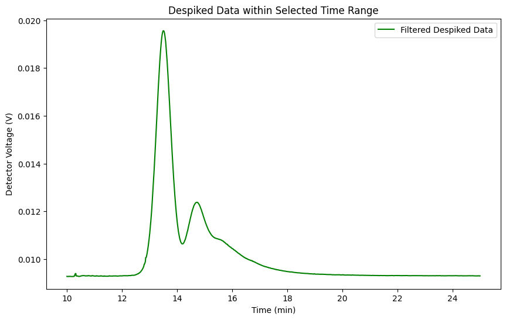
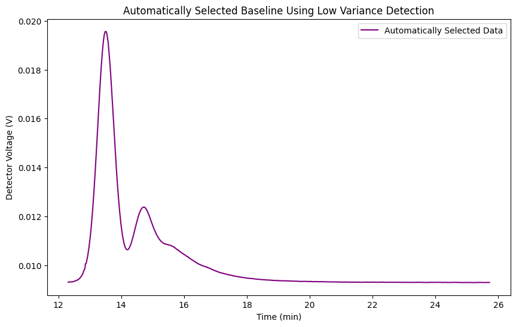

# Project Description

The team at NMI currently use Astra8 Software to do data analysis using their AF4 machine. This software acts as a kind of 'black box', in that obtaining fundamental proof of the algorithms / code used to do data treatment is either extremely difficult to obtain, or not possible (realistically). Additionally, the reports generated by Astra often contain too much non-useful information.

Traceability is a foundational cornerstone of nanometrology (and metrology in general), and so, I've been tasked with creating an open source template that will do the required data treatment, while also giving greater flexibility to displaying only the data that is required for a specific kind of experiment or sequence.

The order of treatments done by the team currently using Astra is:
1. Despiking
2. Baseline Selection
3. Peak Definitions
4. Molar Mass & Radius from Light Scattering (LS)
5. Hydrodynamic Radius $R_h$ from LS
6. Distribution Analysis

My goal is to write code that will do each of the above, both in that order, and individually. Once I've got together all of the equations and procedures required, I will transfer the code to Stata (provided by MQ), and then port into OriginLabs, which is the software that NMI staff have access to.

## Useful Libraries
I have used the following libraries:
- `pandas` for data manipulation and analysis, particularly with data structures like DataFrames, which are great for handling tabular data.
- `numpy` for numerical computations in Python, providing support for large, multi-dimensional arrays and matrices. The library comes along with a collection of mathematical functions to operate on these arrays.
- `matplotlib.pyplot`, which is a plotting library used for creating static, interactive, and animated visualizations in Python, particularly for 2D plots and graphs.
- `scipy.signal.medfilt`, a function within the SciPy library’s signal processing module, used for applying a median filter to a signal, which is helpful in reducing noise in data.
- =='scipy.signal.find_peaks'== WRITE ABOUT

## 1. Despiking
For this step, I have chosen to go with the Median Filter method, as described in the Theory section. The kernel size I have chosen in the below figure is 5.

## 2. Baseline Selection
Baseline selection trims the time axis to only view data within specified time peiords. There are two ways to do this:
1. Manual selection of start and end
2. Automatic baseline selection

### Manual Selection
Here is the code for manual selection of time:
    #Definitions
    start_time = 10
    end_time = 25

    # Filter the data to include only defined times
    filtered_indices = (time >= start_time) & (time <= end_time)
    filtered_time = time[filtered_indices]
    filtered_signal = median_signalIntensity[filtered_indices]

    # plot
    plt.figure(figsize=(10,6))
    plt.plot(filtered_time,filtered_signal, label='Filtered Despiked Data',color='green')
    plt.xlabel('Time (min)')
    plt.ylabel('Detector Voltage (V)')
    plt.title('Despiked Data within Selected Time Range')
    plt.legend()
    plt.show()
Producing the following:

### Automatic Selection
This is a low variance method, containing the following code

    base_window_size = 10

    # rolling std dev of the signal
    rolling_std = pd.Series(median_signalIntensity).rolling(window=base_window_size).std()

    # low variance threshold / baseline detection
    std_threshold = np.min(rolling_std) * 2

    # indices where the std dev is below the threshold
    low_variance_indices = np.where(rolling_std < std_threshold)[0]

    # first and last low var points as start and end times
    start_index = low_variance_indices[0]
    end_index = low_variance_indices[-1]

    # extract time and signal for range
    base_filtered_time = time[start_index:end_index+1]
    base_filtered_signal = median_signalIntensity[start_index:end_index + 1]

    # plot
    plt.figure(figsize=(10, 6))
    plt.plot(base_filtered_time, base_filtered_signal, label='Automatically Selected Data', color='purple')
    plt.xlabel('Time (min)')
    plt.ylabel('Detector Voltage (V)')
    plt.title('Automatically Selected Baseline Using Low Variance Detection')
    plt.legend()
    plt.show()

Producing 

Notes on special variables:
- `base_window_size`, or **rolling window size** determines how many data points are considered when calculating the standard deviation at each point in the data. 

A **smaller** window size makes the rolling std. deviation more sensitive to short-term fluctuation or noise. May detect more local variations, but also pick up noise as part of the baseline.

A **larger** window size smooths out short term fluctuations. May miss shorter fluctuations but avoids false positives from noise.

- `std_threshold`, or **Standard Deviation Threshold** determins what is considered a _low variance_ segment in the signal. This calculates the minimum value of the rolling standard deviation across the entire signal. This minimum value represents the lowest level of variability observed in any segment of the data. The threshold is defined as twice the smallest rolling standard deviation observed in the data. Any segment of the data where the rolling standard deviation is below this threshold is considered to be part of the baseline.

A **Lower** thresholds mean that only very low variance segments (very little fluctuation) will be considered as part of the baseline, likely resulting in fewer, shorter baseline segments being selected, leading to a potentially more restrictive baseline.

A **Higher** threshold allows segments with slightly higher variance to be included in the baseline, leading to a more inclusive baseline at the risk of including segments with significant variation.

## Peak Selection
The peak selection process was pretty challenging. There are three methods of obtaining peaks:
1. Manually, using an interactive py script
2. Manually, by defining the peaks within the code
3. Automatically.

==Discuss all three later==

### Manual Peaks
### Hard Coded Peaks
### Automatic Peaks

## Molar Mass Calculations
No Refractive Index (RI) detector, so will be using the UV detector data to calculate dn/dc
## Hydrodynamic Radius ($R_h$) from Light Scattering
